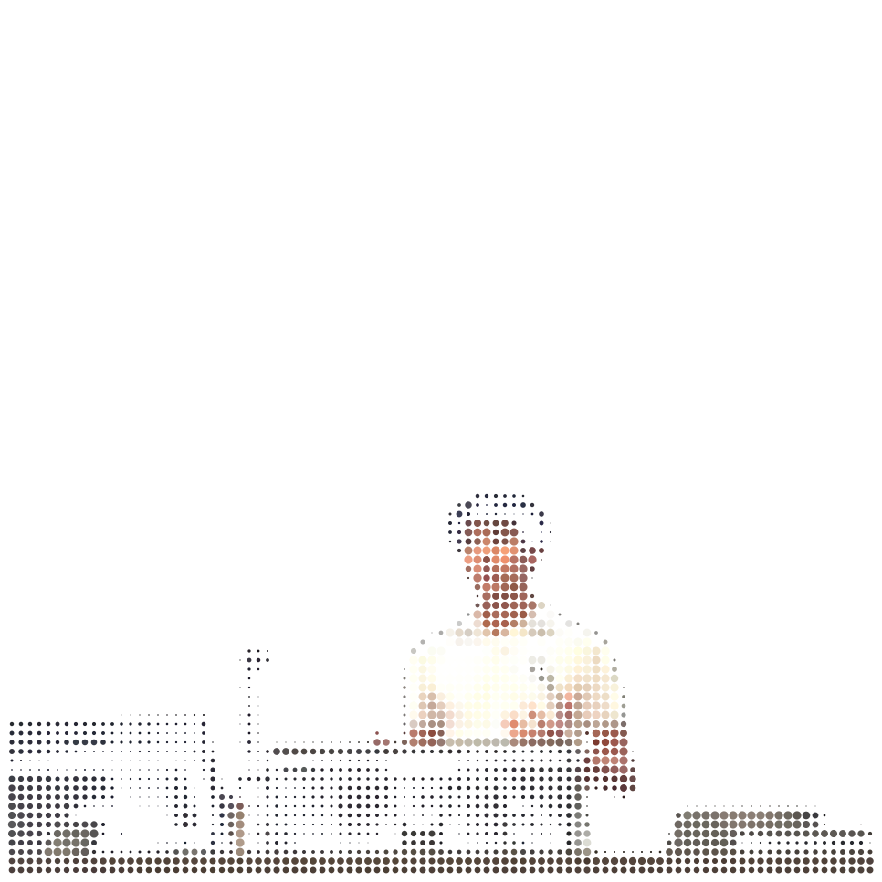

<div align="center">

<!-- PORTRAIT — dot-matrix, generated by scripts/dotify.py from assets/source.png.
     Regenerate:  python scripts/dotify.py assets/source.png -o assets/portrait-full \
       --cols 100 --equalize --detail 0.5 --color -->


<br>

<!-- NAME / TAGLINE — animated typing -->
<a href="https://github.com/AnikS22">
  
</a>

<br>

<!-- SOCIALS -->
<a href="https://www.linkedin.com/in/aniksahai/"></a>
<a href="https://x.com/n1kdev"></a>
<a href="https://aniksahai.com"></a>

<br>


</div>

---

## `~/` whoami

```console
$ cat about.txt
```

Robotics + VLA researcher working on **sample efficiency in embodied learning** — teaching robots
to learn as fast as human brains.

- 🔬 Researching sample efficiency in embodied learning at Wilks H Honors (FAU HS) — published researcher
- 🤖 Building **training-free robotic navigation** on xArm6 + Ranger Mini 3, and converting a 2018 Gem e4 into a **self-driving vehicle**
- 🚀 Founder of **AuthAI** (healthcare prior-auth automation) · co-founder of **The Ethics Lab**
- 📚 Learning: statistical learning theory, sim-to-real transfer, computational neuroscience
- 🤝 Open to collaborating on: robot learning, VLA evaluation, anything at the intersection of neuroscience and embodied AI
- 📍 Boca Raton, FL — ET

<br>

<div align="center">

## `~/` toolbox


<sub>ROS2 · NVIDIA Isaac Sim / Lab · MuJoCo · Hugging Face · NumPy · Pandas · CUDA</sub>

</div>

---

## `~/` selected work

- **FLARE** — Predicting vision-language-action policy failures from frozen activations. AUROC 0.79, sub-millisecond overhead.
- **Unlocking the Path** — Robotic navigation that treats doors and elevators as permeable states — cheaper and more accurate.
- **PhysMent** — *Accepted to the ICML 2026 AI4Math Workshop.* A MuJoCo benchmark testing whether LLMs can reason about physics by actively experimenting with simulated environments.
- **Self-Driving Golf Cart** — 2018 Gem e4 converted to full drive-by-wire on a unified ROS control stack.
- **Who Do You Think You're Talking To** — Longitudinal study showing AI identity disclosure significantly shapes relational communication.

---

<div align="center">

## `~/` contribution calendar

<!-- 3D isometric calendar — regenerated every 6h by .github/workflows/metrics.yml -->


<br><br>

<!-- Snake eats the contribution graph — .github/workflows/snake.yml -->
<picture>
  <source media="(prefers-color-scheme: dark)"  srcset="https://raw.githubusercontent.com/AnikS22/AnikS22/output/snake-dark.svg">
  <source media="(prefers-color-scheme: light)" srcset="https://raw.githubusercontent.com/AnikS22/AnikS22/output/snake.svg">
  
</picture>

</div>
